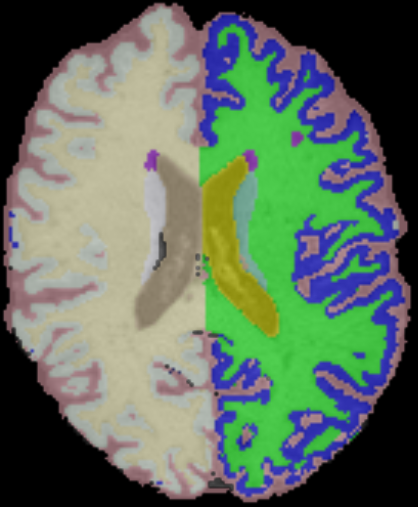
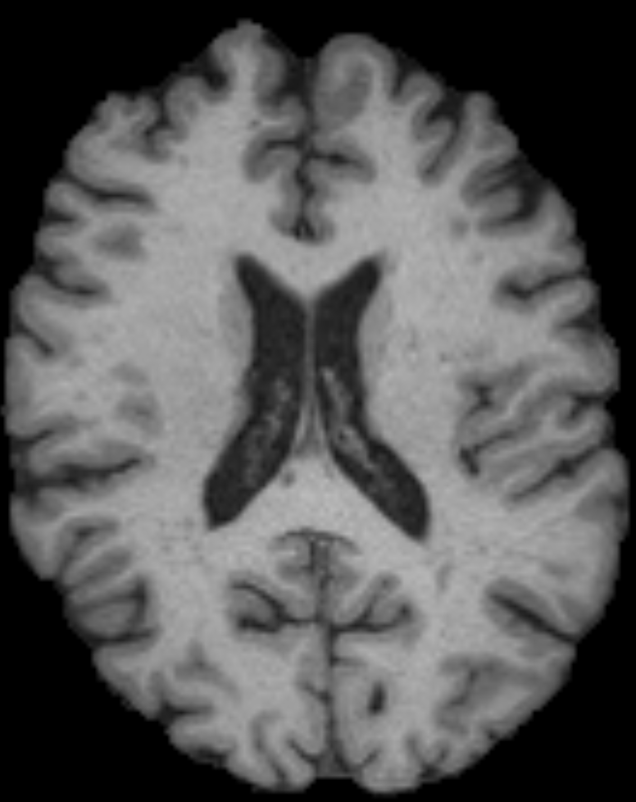

<h1 align="center">MSReport-generator </h1>

> Scripts to generate a structured report for MS patients in the form of a `.xlsx` table. Such table contains useful per-patient information, such as the total number of MS lesions, their location, center of mass and volume from the MRI, and prediction uncertainty (lesion and patient scales).
> <br /> `MSReport-generator` can provide clinical details in line with the updated McDonald criteria (periventricular, infratentorial, juxtacortical and white matter lesion location), as well as detect false positive examples located outside of the brain.
> The pipeline is based on an automatic lesion segmentation method, brain parcellation using WMH-SynthSeg (FreeSurfer) and FSL.

## 🚀 Usage

First, make sure you have python >=3.11 and FreeSurfer 8.0.0 installed.

To build the environment, an installation of conda or miniconda is needed. Once you have it, please use
```sh
conda env create -f environment.yml
```
to build the tested environment using the provided `environment.yml` file. 

The script `report.sh` computes all the steps (automatic segmentation, uncertainty computation, brain parcellation, and report generation) and saves the report as a file `report.xlsx`.
The environment variables should be changed according to the user's local machine.
Usage is the following:
```sh
bash ./report.sh {PATH_TO_DATA}
```
The brain parcellation is aimed to seek lesion location according to McDonald criteria for MS diagnosis.
The segmentations of ventricles, cortex, cerebellum and brainstem were exploited to this end.
The segmentation of white matter hyperintensities in SAMSEG was replaced by our MS lesion segmentation output [1]. 
Below, an example of WMH-SynthSeg output, and the segmentation used to locate MS lesions.

|  |  |
|:--:|:--:|
| *WMH-SynthSeg parcellation* | *Segmentation of McDonald criteria's relevant regions* |

## 🙏 Code Contributors

This work is part of the project MSxplain.

## Author

👤 **Federico Spagnolo**

- Github: [@federicospagnolo](https://github.com/federicospagnolo)
- | [LinkedIn](https://www.linkedin.com/in/federico-spagnolo/) |

## References
1. Spagnolo, F., Molchanova, N., Schaer, R., Bach Cuadra, M., Ocampo Pineda,
M., Melie-Garcia, L., Granziera, C., Andrearczyk, V., Depeursinge, A.: Instance-
level quantitative saliency in multiple sclerosis lesion segmentation. arXiv (2024).
https://doi.org/10.48550/ARXIV.2406.09335
2. O. Puonti, J.E. Iglesias, K. Van Leemput. Fast and sequence-adaptive whole-brain segmentation using parametric Bayesian modeling. NeuroImage, 143, 235-249, 2016.
3. N. Molchanova, V. Raina, A. Malinin, F.L. Rosa, A. Depeursinge, M. Gales, C. Granziera, H. Müller, M. Graziani, M.B. Cuadra. Structural-based uncertainty in deep learning across anatomical scales: Analysis in white matter lesion segmentation. Comput. Biol. Med., 184 (2025), 109336, https://doi.org/10.1016/j.compbiomed.2024.109336
